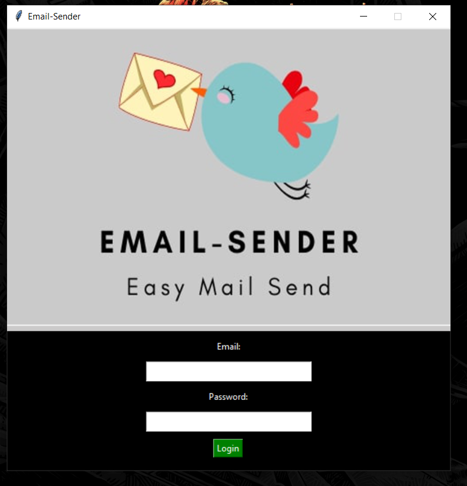
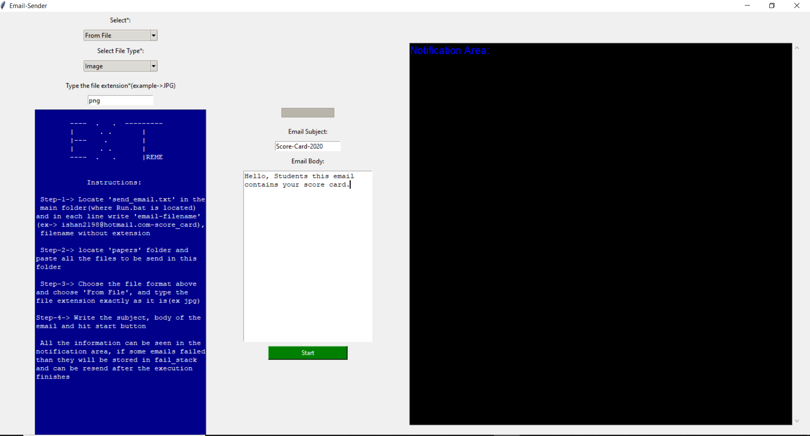
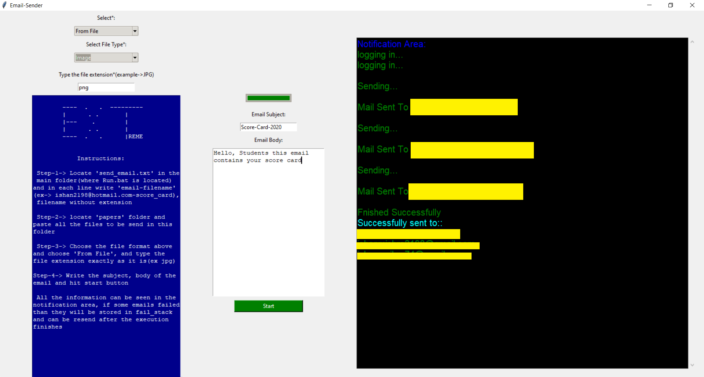

<h1 align="center"> <ins>Bulk-Email-Sender</ins> </h1>
<h4 align="center"> Easy Mail Send </h4>

<h2>Basic Introduction</h2>

* This Application can be used to send emails using gmail id with attachements to a list of people by just one click.

* It uses *fail_stack* to store the emails with unsuccessful send.

* Thus if internet connection fails in between the process, than process can be restarted when connection restores

<h2>How To Setup(for non programmers)</h2>

* Locate and run *Setup.bat*(this is for first time only no need to run it after)

* Locate and run *Run.bat*(use this file everytime to run the programme)

<h2>How To Setup(for programmers)</h2>

* Make new enviroment

* Use *requirements_conda.txt* for anaconda

* Use *requirements_pip.txt* for pip

<h2>How To Use</h2>

* Run the programme using *Run.bat* or *python main.py*

* Signin using gmail id(click login button).
**Note**->Remember to turn on [allow less secure apps](myaccount.google.com/lesssecureapps)

* Choose your configuration.

* Edit *send_email.txt* and save it.
**sample edit**->
email1-filename1
email2-filename2
email3-filename3

all filenames must **not** include the extensions
'-' between filename and email is necessary
**email should be of form username@domain.com**
**email address should not contain '-'**

[sample screenshot]()

* Paste all the attachement files in *papers* folder

* Press start button

**If for some reason process fails, the application will ask users** 
**to start again for failed emails or not**
